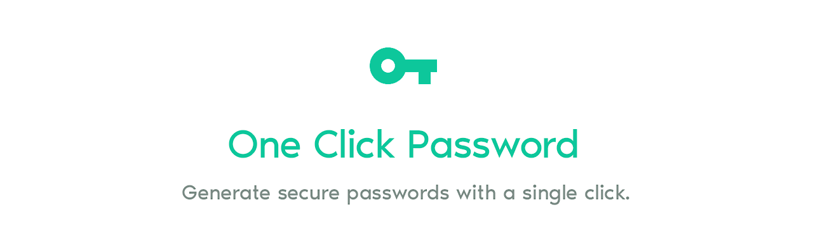
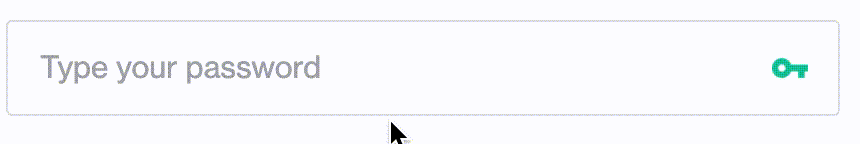
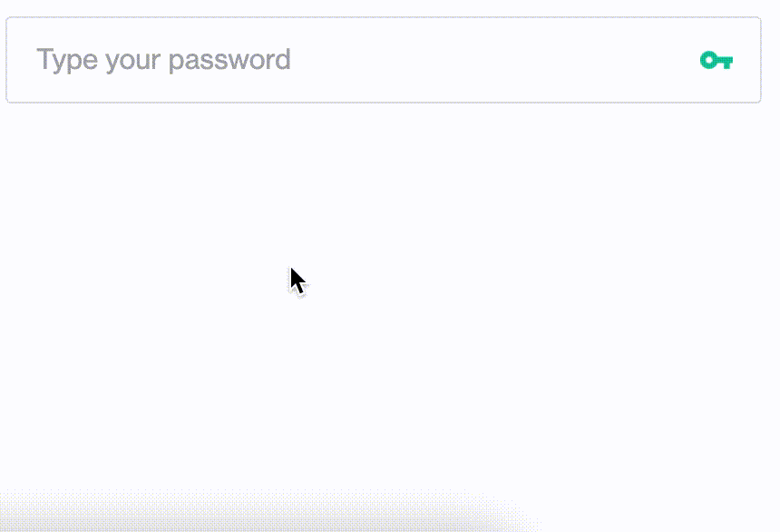

# One Click Password

An extension for Chrome that adds a button to input fields to automatically generate secure passwords.

## Installation

### Chrome Web Store

[Available on the Chrome Web Store](https://chrome.google.com/webstore/detail/one-click-password/jdnbggiobjbbhneljfijfinfligegblp)

### Manual/Development

1. Clone this repo.
2. Open the Extensions page in Chrome by clicking the menu icon -> More tools -> Extensions, or by going to [chrome://extensions/](chrome://extensions/).
3. Check the "Developer Mode" checkbox.
4. Click the "Load unpacked" button and select the directory where you cloned this repo.
5. <em>One Click Password</em> should now appear in your list of extensions.

## Usage

One Click Password can be triggered by either clicking the green key on the right of password inputs:

or right-clicking on an input field and selecting "Generate password" from the context menu:

Generated passwords are randomly generated alphanumeric strings with at least 2 special characters.

### Examples:

> -!n0bJ1Mb#GeTJ_kJFgZ

> RJ!19OF_6NI4-i!yqdBb

> m8FHMLh-bKvmy!M9hhMm

You can also optionally change the default generated password length (20 characters) in One Click Password's extension settings.

## License

[MIT](https://choosealicense.com/licenses/mit/)
